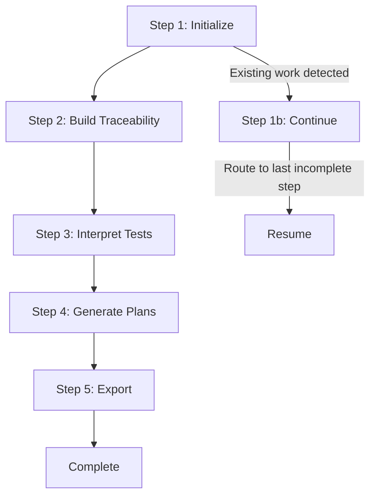

# Traceability & Test Planning Workflow

**Version:** 1.0.0
**Phase:** 4-implementation
**Module:** BMM (BMAD Methodology Manager)

---

## Overview

The **traceability-and-testing** workflow generates comprehensive functional requirements traceability maps and consolidated epic-level test plans by analyzing your existing requirements documentation and test case repository.

**What this workflow does:**

1. ✅ Creates complete FR→Epic→Story→Task traceability hierarchy
2. ✅ Maps existing test cases to requirements traceability
3. ✅ Generates consolidated test plans per Epic
4. ✅ Calculates coverage metrics and identifies testing gaps
5. ✅ Exports artifacts to both Markdown and Excel formats

**Input Requirements:**

- `epics.md` - Epic and story definitions (from Phase 3: Solutioning)
- `pruebas_comandera.xlsm` - Existing test case repository (Excel)

**Output Artifacts:**

- Traceability map (Markdown + Excel)
- Epic test plans (one per Epic)
- Coverage analysis and gap reports
- Master documentation index

**Test Scope:**

🎯 **IMPORTANT:** This workflow focuses on **functional-level testing and above**.

- ✅ **Funcional:** Acceptance tests validating features from user perspective
- ✅ **Integración:** Tests validating component/module interactions
- ✅ **E2E:** Tests validating complete user journeys
- ❌ **NOT included:** Unit tests (code-level testing)

---

## Quick Start

### Basic Usage

**Process all epics:**
```
/traceability-and-testing
```

**Process a specific epic:**
```
/traceability-and-testing 1    # Process only Epic 1
/traceability-and-testing 2    # Process only Epic 2
```

If no epic number is provided, the workflow will ask you to select which epics to process.

**💡 Tip:** Start with a single epic to quickly validate the workflow behavior, then run for all epics when ready.

---

### Prerequisites

Before running this workflow, ensure you have:

1. **Completed Phase 3 (Solutioning):**
   - `epics.md` file exists in `_bmad-output/planning-artifacts/`
   - Contains Functional Requirements, Epics, and Stories
   - Includes FR Coverage Map section

2. **Test Cases Repository:**
   - `pruebas_comandera.xlsm` file in project root
   - Contains test cases with columns like: ID, Name, Module, Priority, etc.

3. **BMAD6 Configuration:**
   - `_bmad/bmm/config.yaml` properly configured
   - `planning_artifacts` path defined
   - Language settings configured

### Execution

**Option 1: From BMAD6 CLI**

```bash
# Navigate to project root
cd /path/to/project

# Execute workflow (method depends on your BMAD6 setup)
bmad run bmm:workflows:traceability-and-testing
```

**Option 2: Direct Claude Invocation**

Tell Claude to execute the workflow:

```
Execute the traceability-and-testing workflow from
_bmad/bmm/workflows/4-implementation/traceability-and-testing/
```

### First Execution

On first run, the workflow will:

1. Validate prerequisites exist
2. Extract FRs, Epics, and Stories from `epics.md`
3. Prompt you for Excel structure information
4. Guide you through 5 sequential steps
5. Generate all artifacts in `_bmad-output/implementation-artifacts/`

**Total time:** ~15-30 minutes depending on project size

---

## Workflow Structure

### Step-File Architecture

This workflow uses BMAD6's step-file architecture for disciplined execution:

```
traceability-and-testing/
├── workflow.md                 ← Main configuration
├── steps/
│   ├── step-01-init.md        ← Initialize & validate prerequisites
│   ├── step-01b-continue.md   ← Resume from interruption
│   ├── step-02-build-traceability.md  ← Build FR→Epic→Story→Task hierarchy
│   ├── step-03-interpret-tests.md     ← Read Excel and map test cases
│   ├── step-04-generate-plans.md      ← Generate epic test plans
│   └── step-05-export.md              ← Export to Excel and finalize
├── templates/
│   ├── traceability-map-template.md
│   └── epic-test-plan-template.md
└── data/
    └── excel-structure-guide.md
```

### Execution Flow



Each step:
- Reads previous context from document frontmatter
- Executes defined sequence (no skipping)
- Updates state and writes output
- Waits for user confirmation before proceeding

---

## Output Artifacts

### Generated Files

After completion, you'll find these artifacts in `_bmad-output/implementation-artifacts/`:

**1. Traceability Map** (`traceability-map.md`)
- Section 1: Traceability Tree (ASCII hierarchy)
- Section 2: Traceability Matrices
- Section 3: Coverage Analysis
- Section 4: Detailed Traceability per FR
- Section 5: Test Coverage Analysis
- Section 6: Test Case Mapping
- Section 7: Detailed Test Coverage by Epic
- Section 8: Epic Test Plans Summary

**2. Epic Test Plans** (`epic-test-plans/`)
- `INDEX.md` - Master index
- `epic-1-test-plan.md` - One per Epic
- Each plan includes: objectives, scope, test cases by story, execution strategy, risk assessment

**3. Excel Export** (`exports/traceability-and-test-plans.xlsx`)
- Sheet 1: Summary (project overview)
- Sheet 2: FR-Epic Mapping
- Sheet 3: Epic-Story Mapping
- Sheet 4: Test Coverage
- Sheet 5: Epic Test Plans
- Sheet 6: Testing Gaps (color-coded by severity)

**4. Master Index** (`traceability-and-testing-INDEX.md`)
- Complete artifact directory
- Usage guide
- Statistics summary
- Next steps recommendations

### File Size Expectations

For a typical project:
- `traceability-map.md`: 20-50 KB
- `epic-test-plans/`: 5-15 KB per Epic
- `traceability-and-test-plans.xlsx`: 100-500 KB
- Total output: ~1-2 MB

---

## Key Features

### 1. Continuation Support

The workflow can be interrupted and resumed:

- **Auto-detection**: Detects existing work on startup
- **State tracking**: Uses `stepsCompleted` array in frontmatter
- **Smart routing**: Resumes from last incomplete step
- **No data loss**: All intermediate state is preserved

**Example:**
```yaml
# In traceability-map.md frontmatter:
stepsCompleted: [1, 2, 3]  # Completed through Step 3
# Next run automatically resumes at Step 4
```

### 2. Hybrid Excel Reading

Flexible approach to reading Excel files:

**Primary Strategy: Python/openpyxl**
- Automatic reading using Python subprocess
- Parses all sheets and columns
- Preserves data types

**Fallback Strategy: Manual CSV Export**
- If Python fails (permissions, missing libs)
- User exports sheets to CSV manually
- Workflow reads CSV files instead

### 3. Multi-Strategy Test Case Mapping

Maps test cases to traceability using:

1. **Direct Reference** - Uses FR/Epic columns if present
2. **Module Similarity** - Matches module names to Epic titles
3. **Text Similarity** - Compares descriptions for keyword overlap
4. **Manual Mapping** - Interactive user selection for unmapped cases

### 4. Comprehensive Coverage Analysis

Calculates metrics at multiple levels:

- **FR Coverage**: % of FRs covered by Epics
- **Epic Coverage**: % of Epics with test cases
- **Story Coverage**: % of Stories with test cases
- **AC Coverage**: % of Acceptance Criteria covered by tests
- **Gap Analysis**: Identifies untested areas

### 5. Bilingual Operation

- **User Interface**: Spanish (per `communication_language` config)
- **Generated Documents**: English (per `document_output_language` config)
- **Configurable**: Change in `_bmad/bmm/config.yaml`

---

## Usage Scenarios

### Scenario 1: New Project - First Traceability Map

**When:** You've completed Phase 3 (epics.md exists) and have existing test cases

**Steps:**
1. Ensure `epics.md` is complete with FR Coverage Map
2. Place `pruebas_comandera.xlsm` in project root
3. Execute workflow
4. Provide Excel structure information in Step 1
5. Review and confirm each step
6. Receive complete traceability and test plans

**Result:** Complete baseline traceability with test coverage analysis

---

### Scenario 2: Continuing Interrupted Workflow

**When:** Workflow was interrupted (session ended, error occurred)

**Steps:**
1. Re-execute workflow
2. Workflow auto-detects existing `traceability-map.md`
3. Select "Continue" option
4. Review progress summary
5. Confirm to resume from last incomplete step
6. Complete remaining steps

**Result:** Seamless continuation without redoing completed work

---

### Scenario 3: Updating Traceability After Changes

**When:** `epics.md` or test cases have been updated

**Steps:**
1. Backup existing `traceability-map.md` (optional)
2. Delete `traceability-map.md` and `epic-test-plans/`
3. Re-execute workflow
4. Review new traceability with updated data

**Result:** Refreshed traceability map with current data

---

### Scenario 4: Sharing Results with Stakeholders

**When:** Need to present traceability and test coverage to team/stakeholders

**Steps:**
1. Open `exports/traceability-and-test-plans.xlsx`
2. Use Summary sheet for executive overview
3. Use Testing Gaps sheet for prioritization discussions
4. Share epic test plans for detailed review

**Result:** Professional Excel reports ready for stakeholder review

---

## Configuration

### Required Config in `_bmad/bmm/config.yaml`

```yaml
# Project identification
project_name: "Your Project Name"

# User settings
user_name: "YourTeamName"
communication_language: "Spanish"      # User interface language
document_output_language: "English"    # Generated documents language

# Critical paths
planning_artifacts: "{project-root}/_bmad-output/planning-artifacts"
implementation_artifacts: "{project-root}/_bmad-output/implementation-artifacts"

# Output folder
output_folder: "{project-root}/_bmad-output"
```

### Optional Customization

**Excel File Name:**
Default: `pruebas_comandera.xlsm`

To use a different file:
1. Place your Excel file in project root
2. When Step 1 asks for file location, provide the path

**Input/Output Directories:**
- **Input:** `epics.md` from `planning_artifacts` (Phase 3: Solutioning output)
- **Output:** Traceability artifacts to `implementation_artifacts` (Phase 4: Implementation)

To change:
- Modify `planning_artifacts` or `implementation_artifacts` paths in config.yaml
- Workflow will respect the configured paths

---

## Troubleshooting

### Issue: "epics.md not found"

**Cause:** Phase 3 (Solutioning) not completed

**Solution:**
1. Execute `create-epics-and-stories` workflow first
2. Ensure output is in `_bmad-output/planning-artifacts/epics.md`
3. Re-run traceability workflow

---

### Issue: "Excel file not found"

**Cause:** `pruebas_comandera.xlsm` not in project root

**Solution:**
1. Place Excel file in project root directory
2. Or provide custom path when prompted in Step 1
3. Ensure file is not open in Excel (file lock)

---

### Issue: "Python openpyxl failed"

**Cause:** Python not installed or openpyxl library missing

**Solution:**
1. Workflow will offer manual CSV export option
2. Open Excel file
3. Export each sheet to CSV format
4. Save in `temp-csv/` directory
5. Inform workflow when ready

---

### Issue: "Many test cases unmapped"

**Cause:** Test cases lack FR/Epic references or module names don't match

**Solution:**
1. Review suggested mappings carefully
2. Use manual mapping for ambiguous cases
3. Consider updating Excel file with FR/Epic columns
4. Re-run workflow with improved Excel structure

---

### Issue: "Workflow state corrupted"

**Cause:** Manual editing of `traceability-map.md` frontmatter

**Solution:**
1. Delete `traceability-map.md`
2. Delete `epic-test-plans/` directory
3. Re-execute workflow from beginning
4. Do not manually edit generated files

---

### Issue: "Excel export failed"

**Cause:** Python script execution failed

**Solution:**
1. Install openpyxl: `pip install openpyxl`
2. Run script manually:
   ```bash
   cd _bmad-output/implementation-artifacts/exports
   python export_to_excel.py export_data.json traceability-and-test-plans.xlsx
   ```
3. If still fails, use the JSON data and create Excel manually

---

## Best Practices

### 1. Prepare Your epics.md

✅ **Do:**
- Include complete FR Coverage Map section
- Use consistent FR IDs (FR-001, FR-002, etc.)
- Structure Epics with clear hierarchy
- Document all Stories under each Epic
- Include Acceptance Criteria for each Story

❌ **Don't:**
- Skip the FR Coverage Map section
- Use inconsistent ID formats
- Leave Epics without Stories
- Forget to link FRs to Epics

### 2. Structure Your Excel Test Cases

✅ **Do:**
- Use standard column names (ID, Name, Module, Priority)
- Include FR/Epic/Story reference columns
- Match module names to Epic titles
- Use descriptive test case names
- Organize related tests in named sheets

❌ **Don't:**
- Use cryptic column names
- Have duplicate test IDs
- Leave module column empty
- Mix multiple test types in unclear ways

### 3. During Workflow Execution

✅ **Do:**
- Read and follow step instructions carefully
- Review generated content before confirming
- Ask questions if anything is unclear
- Correct mappings when workflow suggests them
- Save/backup artifacts after completion

❌ **Don't:**
- Skip reading step instructions
- Auto-confirm without reviewing
- Manually edit generated files during workflow
- Interrupt workflow unnecessarily
- Delete intermediate files during execution

### 4. After Workflow Completion

✅ **Do:**
- Review traceability-and-testing-INDEX.md first
- Check Testing Gaps sheet in Excel
- Validate epic test plans with team
- Address identified testing gaps
- Keep artifacts version controlled

❌ **Don't:**
- Ignore identified gaps
- Manually edit generated files
- Forget to share with stakeholders
- Neglect to update when requirements change

---

## Advanced Usage

### Re-running for Updates

**When to re-run:**
- New Epics/Stories added to epics.md
- Test cases added to Excel file
- Requirements changed significantly

**Process:**
1. Update source files (epics.md, Excel)
2. Backup existing artifacts (optional)
3. Delete output files
4. Re-execute workflow

**Incremental updates:**
- Not currently supported
- Full re-execution required for changes

### Customizing Templates

**Location:**
- `templates/traceability-map-template.md`
- `templates/epic-test-plan-template.md`

**Customization:**
1. Edit template files before running workflow
2. Modify sections, add fields, change formatting
3. Keep placeholder variables ({{...}})
4. Test with a small project first

**Note:** Changes apply to future runs, not existing artifacts

### Integrating with CI/CD

**Export validation:**
```bash
# Check if Excel export exists
if [ -f "_bmad-output/implementation-artifacts/exports/traceability-and-test-plans.xlsx" ]; then
  echo "Traceability export found"
else
  echo "ERROR: Traceability export missing"
  exit 1
fi
```

**Coverage threshold enforcement:**
```bash
# Extract coverage rate from frontmatter
coverage=$(grep "testCoverageRate:" traceability-map.md | cut -d: -f2 | tr -d ' %')

if [ "$coverage" -lt 80 ]; then
  echo "ERROR: Test coverage ${coverage}% below threshold 80%"
  exit 1
fi
```

---

## Support and Documentation

### Related Workflows

- **Prerequisites:**
  - `create-prd` - Phase 2: Product Requirements
  - `create-architecture` - Phase 3: System Architecture
  - `create-epics-and-stories` - Phase 3: Epic/Story Generation

- **Follow-up:**
  - `dev-story` - Phase 4: Story Implementation
  - `code-review` - Phase 4: Code Review

### References

- **Main Workflow:** `workflow.md`
- **Step Files:** `steps/step-*.md`
- **Template Guide:** `data/excel-structure-guide.md`
- **BMAD6 Config:** `_bmad/bmm/config.yaml`

### Getting Help

**In-workflow:**
- Each step provides contextual guidance
- Ask questions at any confirmation point
- Workflow will provide troubleshooting suggestions

**Documentation:**
- This README for overview
- `USAGE-GUIDE.md` for detailed walkthrough
- `data/excel-structure-guide.md` for Excel structures

**Community:**
- BMAD6 GitHub repository
- Project team documentation
- BMAD methodology guides

---

## Changelog

### Version 1.0.0 (Initial Release)

**Features:**
- Complete FR→Epic→Story→Task traceability
- Excel test case reading (hybrid Python/CSV)
- Multi-strategy test case mapping
- Epic-level test plan generation
- Excel export with 6 sheets
- Continuation support
- Bilingual operation (ES/EN)

**Known Limitations:**
- Requires Python for Excel auto-reading (CSV fallback available)
- No incremental updates (full re-run required)
- Limited to functional requirements (NFRs not included)
- No test execution tracking (only planning)

---

## License

This workflow is part of the BMAD6 framework.

---

**For detailed step-by-step usage instructions, see [USAGE-GUIDE.md](USAGE-GUIDE.md)**
