# Step 5: Generación de Contenido en Español

## STEP GOAL:

Generar todo el contenido de la guía de usuario en español, incluyendo todas las secciones obligatorias (Introduction, Getting Started, Core Concepts, Features, Workflows, FAQ, Glossary, Screenshot Index) y opcionales (Troubleshooting si fue solicitado). Cada feature y workflow debe incluir diagrama Mermaid, screenshot placeholders y source citations. Este es un step autónomo donde el agente trabaja sin requerir input constante, pero ofrece checkpoints para revisión.

## MANDATORY EXECUTION RULES (READ FIRST):

### Universal Rules:

- 🛑 NEVER generate content without user input
- 📖 CRITICAL: Read the complete step file before taking any action
- 🔄 CRITICAL: When loading next step with 'C', ensure entire file is read
- 📋 YOU ARE A FACILITATOR, not a content generator
- ✅ YOU MUST ALWAYS SPEAK OUTPUT In your Agent communication style with the config `{communication_language}`

### Role Reinforcement:

- ✅ You are a technical writer and content generation specialist
- ✅ If you already have been given communication or persona patterns, continue to use those while playing this new role
- ✅ We engage in collaborative dialogue, not command-response
- ✅ You bring technical writing expertise and structure
- ✅ Maintain collaborative professional tone throughout

### Step-Specific Rules:

- 🎯 Focus ONLY on Spanish content generation (PRESCRIPTIVE execution)
- 🚫 FORBIDDEN to translate to English yet (that's step-06)
- 💬 Work autonomously with progress updates
- 📊 MUST include: Mermaid diagrams, screenshot placeholders, source citations for EVERY feature/workflow

## EXECUTION PROTOCOLS:

- 🎯 Follow prescriptive sequence exactly
- 💾 Append-only: add content progressively to outputFile
- 📖 Set `stepsCompleted: [1, 2, 3, 4, 5]` before loading next step
- 🚫 FORBIDDEN to skip sections or omit required elements

## CONTEXT BOUNDARIES:

- All preferences from frontmatter (technical_level, scenarios, exclusions)
- Features and workflows from step-03 analysis
- Target audience from step-01
- This is autonomous generation with checkpoints

## MANDATORY CONTENT REQUIREMENTS:

**For EVERY Feature:**
1. Clear description (adapted to technical_level)
2. Mermaid diagram (flowchart or appropriate type)
3. At least 1 screenshot placeholder with unique ID
4. Source citation `[Source: Epic X Story Y]`

**For EVERY Workflow:**
1. Step-by-step instructions
2. Mermaid diagram (flowchart TD showing process)
3. Screenshot placeholders for each major step
4. Source citation

**For ALL Content:**
- Use Spanish language
- Respect technical_level setting
- Include warnings/limitations where appropriate
- Create unique screenshot IDs in UPPER_SNAKE_CASE format

## EXECUTION SEQUENCE (PRESCRIPTIVE):

### 1. Load Data Files

Load `{sectionStructureData}` to understand section order and requirements.
Load `{diagramTypesData}` to know which diagram types to use for different content.

### 2. Announce Generation Start

"📝 **Iniciando Generación de Contenido en Español**

Voy a generar todas las secciones de la guía de usuario en español. Esto incluye:

**Secciones obligatorias:**
- Introducción (Introduction)
- Primeros Pasos (Getting Started)
- Conceptos Clave (Core Concepts)
- Funcionalidades (Features - {features_count} identificadas)
- Flujos de Trabajo (Workflows - {workflows_count} identificados)
- Preguntas Frecuentes (FAQ)
- Glosario (Glossary)
- Índice de Capturas (Screenshot Index)

**Secciones opcionales:**
{if include_troubleshooting}
- Solución de Problemas (Troubleshooting)
{endif}

Este proceso es autónomo pero te notificaré al completar cada sección principal. La generación puede tomar varios minutos..."

### 3. Generate Introduction Section

Append to `{outputFileSpanish}`:

```markdown
## Introducción

### ¿Qué es {project_name}?

[Generate 2-3 paragraphs describing the system based on PRD analysis]
- What it does
- What problems it solves
- Key value propositions

### ¿Para quién es esta guía?

Esta guía está diseñada para **{audience_description_es}** que necesitan [describe typical user needs].

{Adapt tone based on technical_level:
- novice: "No se requiere experiencia técnica previa"
- intermediate: "Se asume familiaridad básica con..."
- advanced: "Esta guía asume conocimiento técnico de..."
- mixed: "Esta guía sirve tanto para usuarios nuevos como experimentados"}

### Cómo usar esta guía

[2-3 paragraphs explaining guide structure and how to navigate]
- Qué encontrarán en cada sección
- Cómo buscar información específica
- Convenciones usadas (iconos, screenshots, diagramas)

**Convenciones:**
- 📸 **[Screenshot: ID - Description]**: Marcador de captura de pantalla
- 🔗 **[Source: Epic X Story Y]**: Referencia a documentación fuente
- ⚠️ **Advertencia**: Información crítica
- 💡 **Tip**: Consejos útiles

---
```

**Progress update:** "✓ Sección Introduction completada"

### 4. Generate Getting Started Section

Append to `{outputFileSpanish}`:

```markdown
## Primeros Pasos

### Prerrequisitos

{Generate based on PRD and architecture analysis}

Para usar {project_name}, necesitas:
- [List prerequisites: accounts, permissions, software, etc.]
- [Technical requirements if applicable]
- [Access credentials setup]

### Configuración Inicial

{If UI exists, include setup steps}

#### Paso 1: Acceso al Sistema

[Describe how to access - login, URL, app installation]

[Screenshot: UI_LOGIN - Pantalla de inicio de sesión]

#### Paso 2: Primer Inicio de Sesión

[Describe first-time login process]

#### Paso 3: Navegación de la Interfaz

{Generate based on UI design goals or architecture}

La interfaz de {project_name} está organizada en:
- [Main navigation areas]
- [Key UI components]
- [Common actions locations]

[Screenshot: UI_DASHBOARD - Vista general del dashboard]

```mermaid
flowchart LR
    A[Login] --> B[Dashboard]
    B --> C[Módulo 1]
    B --> D[Módulo 2]
    B --> E[Módulo 3]
    C --> F[Funcionalidades]
```



---
```

**Progress update:** "✓ Sección Getting Started completada"

### 5. Generate Core Concepts Section

Append to `{outputFileSpanish}`:

```markdown
## Conceptos Clave

Esta sección explica los conceptos fundamentales que necesitas comprender para usar {project_name} efectivamente.

### Terminología Básica

{Extract key terms from epics and PRD}

**[Term 1]**: [Definition adapted to technical_level]

**[Term 2]**: [Definition]

[Continue for 5-10 key terms]

### Roles de Usuario

{Extract user roles from PRD and epics}

{project_name} distingue entre diferentes tipos de usuarios:

**{Role 1}**: [Description, permissions, typical tasks]

**{Role 2}**: [Description, permissions, typical tasks]

```mermaid
flowchart TD
    U[Usuario] --> R1[{Role 1}]
    U --> R2[{Role 2}]
    R1 --> P1[Permisos Nivel 1]
    R2 --> P2[Permisos Nivel 2]
```

### Conceptos Principales

{Extract main concepts from architecture and PRD}

[Explain 3-5 core concepts users need to understand]

---
```

**Progress update:** "✓ Sección Core Concepts completada"

### 6. Generate Features Section

**This is the largest section. For EACH feature identified in step-03:**

Append to `{outputFileSpanish}`:

```markdown
## Funcionalidades y Cómo Usarlas

Esta sección documenta todas las funcionalidades disponibles en {project_name}.

{For each feature NOT in features_to_exclude:}

### {Feature Name} {if in features_to_prioritize: ⭐}

**Descripción:**
{Generate description based on epic/story content, adapted to technical_level}

{If critical_warnings related to this feature exist, include:}
⚠️ **Advertencia:** {Warning text}

**Cómo Usar:**

1. {Step 1 description}
2. {Step 2 description}
3. {Step 3 description}
...

{Include screenshot placeholders at relevant steps:}
[Screenshot: FEATURE_{FEATURE_ID}_{STEP} - Description in Spanish]

**Diagrama:**

```mermaid
{Determine appropriate diagram type from diagramTypesData}
{Generate Mermaid diagram showing feature components or flow}
{Ensure labels are in Spanish}
```

{If additional_scenarios mention this feature:}
**Escenarios de Uso:**
- {Scenario 1}
- {Scenario 2}

{If known_limitations affect this feature:}
**Limitaciones:**
- {Limitation 1}

**Source:** [Source: Epic {number} Story {number}]

---

{End for each feature}
```

**Progress update after every 5 features:** "✓ {count} funcionalidades documentadas..."

**Final progress:** "✓ Sección Features completada - {total_features} funcionalidades documentadas"

### 7. Generate Workflows Section

Append to `{outputFileSpanish}`:

```markdown
## Flujos de Trabajo Comunes

Esta sección documenta los procesos paso a paso más comunes en {project_name}.

{For each workflow identified in step-03 or additional_scenarios:}

### Workflow: {Workflow Name}

**Objetivo:** {What this workflow accomplishes}

**Pasos:**

#### Paso 1: {Step 1 Title}

{Detailed description adapted to technical_level}

[Screenshot: WORKFLOW_{WORKFLOW_ID}_STEP1 - Description]

#### Paso 2: {Step 2 Title}

{Detailed description}

[Screenshot: WORKFLOW_{WORKFLOW_ID}_STEP2 - Description]

{Continue for all steps}

**Diagrama del Proceso:**

```mermaid
flowchart TD
    Start[Inicio] --> Step1[{Step 1}]
    Step1 --> Step2[{Step 2}]
    Step2 --> Decision{{¿Condición?}}
    Decision -->|Sí| Step3[{Step 3}]
    Decision -->|No| Step4[{Step 4}]
    Step3 --> End[Fin]
    Step4 --> End
```

{If warnings apply:}
⚠️ **Precauciones:**
- {Warning 1}
- {Warning 2}

**Source:** [Source: {source_reference}]

---

{End for each workflow}
```

**Progress update:** "✓ Sección Workflows completada - {workflows_count} workflows documentados"

### 8. Generate Troubleshooting Section (If Requested)

**IF frontmatter.include_troubleshooting == true:**

Append to `{outputFileSpanish}`:

```markdown
## Solución de Problemas

Esta sección ayuda a resolver problemas comunes que puedes encontrar al usar {project_name}.

### Problema: {Common Issue 1}

**Síntomas:**
- {Symptom 1}
- {Symptom 2}

**Posibles Causas:**
- {Cause 1}
- {Cause 2}

**Solución:**

1. {Solution step 1}
2. {Solution step 2}
3. {Solution step 3}

{If applicable:}
[Screenshot: ERROR_{ERROR_ID} - Error message shown]

{Continue for 5-10 common issues based on known_limitations and general best practices}

### Mensajes de Error Comunes

| Mensaje | Significado | Solución |
|---------|-------------|----------|
| {Error message 1} | {What it means} | {Quick fix} |
| {Error message 2} | {What it means} | {Quick fix} |

---
```

**Progress update:** "✓ Sección Troubleshooting completada"

### 9. Generate FAQ Section

Append to `{outputFileSpanish}`:

```markdown
## Preguntas Frecuentes (FAQ)

{Generate 8-12 FAQs based on:
- Common questions about features
- User scenarios
- Technical level considerations
- Known limitations
}

### General

**P: {Question 1}?**
**R:** {Answer adapted to technical_level}

**P: {Question 2}?**
**R:** {Answer}

### Funcionalidades Específicas

**P: {Feature-specific question}?**
**R:** {Answer with feature reference}

### Troubleshooting

{If troubleshooting section exists, cross-reference}
**P: {Common problem question}?**
**R:** {Brief answer}. Ver sección [Solución de Problemas](#solución-de-problemas) para más detalles.

---
```

**Progress update:** "✓ Sección FAQ completada"

### 10. Generate Glossary Section

Append to `{outputFileSpanish}`:

```markdown
## Glosario

Términos clave usados en esta guía y en {project_name}.

{Extract all technical terms from features, workflows, and core concepts}
{Sort alphabetically}

**[Term A]**: [Definition in Spanish]

**[Term B]**: [Definition]

{Continue for all terms - minimum 15-20 terms}

---
```

**Progress update:** "✓ Sección Glossary completada"

### 11. Generate Screenshot Index

Append to `{outputFileSpanish}`:

```markdown
## Índice de Capturas de Pantalla

Todas las capturas de pantalla referenciadas en esta guía están listadas aquí para fácil referencia.

| ID | Ubicación | Descripción | Estado |
|----|-----------|-------------|--------|
{For each screenshot placeholder created:}
| {SCREENSHOT_ID} | Sección {section_name} | {Description in Spanish} | Pendiente |
{End for}

**Total:** {screenshot_count} capturas de pantalla identificadas

**Nota:** Las capturas de pantalla marcadas como "Pendiente" deben ser capturadas y agregadas al documento final.

---
```

**Progress update:** "✓ Sección Screenshot Index completada"

### 12. Update Frontmatter with Metrics

Update `{outputFileSpanish}` frontmatter:

```yaml
# Content tracking (updated after generation)
features_documented: {actual_count}
workflows_documented: {actual_count}
diagrams_generated: {actual_count}  # Count all mermaid blocks
screenshot_placeholders: {actual_count}  # Count all [Screenshot: ...] markers
source_citations_count: {actual_count}  # Count all [Source: ...] citations

# Quality metrics
completeness_score: 0  # Will be calculated in step-07
review_status: "draft"
```

### 13. Generation Complete Message

"✅ **Generación de Contenido en Español Completada**

**Resumen del Contenido Generado:**

📄 **Secciones:**
- Introduction ✓
- Getting Started ✓
- Core Concepts ✓
- Features: {features_count} documentadas ✓
- Workflows: {workflows_count} documentados ✓
{if troubleshooting: - Troubleshooting ✓}
- FAQ: {faq_count} preguntas ✓
- Glossary: {terms_count} términos ✓
- Screenshot Index ✓

📊 **Métricas:**
- Diagramas Mermaid: {diagrams_count}
- Screenshot placeholders: {screenshots_count}
- Source citations: {citations_count}
- Palabras totales (aprox): {word_count}

El documento español está completo y listo para traducción.

**Siguiente paso:** Traducción a inglés manteniendo estructura idéntica."

### 14. Update State Before Next Step

Before loading next step:
- Ensure frontmatter.stepsCompleted = [1, 2, 3, 4, 5]
- Ensure frontmatter.currentStep = "step-06-traduccion-ingles"
- Save outputFileSpanish

### 15. Present MENU OPTIONS

Display: **Select an Option:** [C] Continue

#### EXECUTION RULES:

- ALWAYS halt and wait for user input after presenting menu
- ONLY proceed to next step when user selects 'C'

#### Menu Handling Logic:

- IF C: Update frontmatter, then load, read entire file, then execute `{nextStepFile}`
- IF Any other: Respond and redisplay menu

## CRITICAL STEP COMPLETION NOTE

ONLY WHEN C is selected and all Spanish content is generated with complete metrics, will you then load, read entire file, then execute `{nextStepFile}` to begin English translation.

---

## 🚨 SYSTEM SUCCESS/FAILURE METRICS

### ✅ SUCCESS:

- All required sections generated
- Every feature has: description + diagram + screenshot(s) + citation
- Every workflow has: steps + diagram + screenshot(s) + citation
- Technical level adaptation applied throughout
- All screenshot placeholders have unique IDs in correct format
- All diagrams are valid Mermaid syntax with Spanish labels
- Screenshot Index consolidated all placeholders
- Frontmatter updated with accurate metrics
- frontmatter.stepsCompleted = [1, 2, 3, 4, 5]
- Ready to proceed to step 6

### ❌ SYSTEM FAILURE:

- Missing required sections
- Features without diagrams or citations
- Workflows without step-by-step instructions
- Screenshot IDs not in UPPER_SNAKE_CASE
- Diagrams with English labels
- Missing Screenshot Index
- Incomplete frontmatter metrics

**Master Rule:** Skipping steps, optimizing sequences, or not following exact instructions is FORBIDDEN and constitutes SYSTEM FAILURE.
