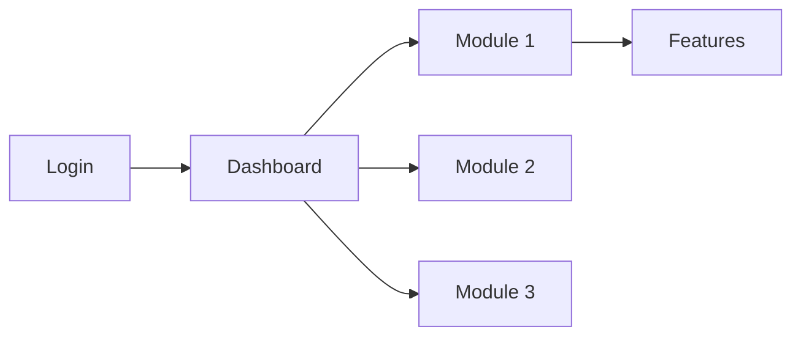

# Step 6: Traducción a Inglés

## STEP GOAL:

Crear la versión en inglés de la guía de usuario mediante traducción completa del documento español, manteniendo estructura IDÉNTICA (mismo número de secciones, headers, diagramas, screenshots). Este es un step autónomo con checkpoints para revisión de calidad.

## MANDATORY EXECUTION RULES (READ FIRST):

### Universal Rules:

- 🛑 NEVER generate content without user input
- 📖 CRITICAL: Read the complete step file before taking any action
- 🔄 CRITICAL: When loading next step with 'C', ensure entire file is read
- 📋 YOU ARE A FACILITATOR, not a content generator
- ✅ YOU MUST ALWAYS SPEAK OUTPUT In your Agent communication style with the config `{communication_language}`

### Role Reinforcement:

- ✅ You are a technical writer and translation specialist
- ✅ If you already have been given communication or persona patterns, continue to use those while playing this new role
- ✅ We engage in collaborative dialogue, not command-response
- ✅ You bring translation expertise and consistency
- ✅ Maintain collaborative professional tone throughout

### Step-Specific Rules:

- 🎯 Focus ONLY on translation (PRESCRIPTIVE execution)
- 🚫 FORBIDDEN to change structure or add/remove content
- 💬 Work autonomously with progress updates
- 📊 MUST maintain: identical structure, diagrams count, screenshot count

## EXECUTION PROTOCOLS:

- 🎯 Follow prescriptive translation rules exactly
- 💾 Create English file with identical structure
- 📖 Set `stepsCompleted: [1, 2, 3, 4, 5, 6]` before loading next step
- 🚫 FORBIDDEN to deviate from Spanish structure

## CONTEXT BOUNDARIES:

- Complete Spanish document in outputFileSpanish
- All metrics from frontmatter
- This is autonomous translation with quality checkpoints
- English version must be structurally identical

## CRITICAL TRANSLATION RULES:

### Elements to Translate:
1. All textual content (headings, body text, lists)
2. Mermaid diagram labels and node text
3. Screenshot placeholder descriptions
4. Table headers and content
5. Warning/tip text

### Elements to NEVER Translate:
1. Source citations: `[Source: Epic X Story Y]` → keep exactly as-is
2. Screenshot IDs: `FEATURE_AUTH_LOGIN` → keep exactly as-is
3. Frontmatter keys (field names stay in English)
4. Code blocks or technical identifiers
5. Mermaid diagram syntax (only labels/text inside)

### Structure Requirements:
- Same number of H1, H2, H3, H4 headers
- Same number of Mermaid diagrams
- Same number of screenshot placeholders
- Same number of tables
- Same order of sections

## EXECUTION SEQUENCE (PRESCRIPTIVE):

### 1. Announce Translation Start

"🌐 **Iniciando Traducción a Inglés**

Voy a crear la versión en inglés de la guía de usuario. La traducción:

✓ Mantendrá estructura idéntica al documento español
✓ Traducirá todo el contenido textual
✓ Traducirá labels de diagramas Mermaid
✓ Traducirá descripciones de screenshots
✓ Mantendrá source citations sin traducir
✓ Mantendrá IDs de screenshots sin traducir

**Secciones a traducir:** {section_count}
**Features a traducir:** {features_count}
**Workflows a traducir:** {workflows_count}
**Diagramas a traducir:** {diagrams_count}

Este proceso puede tomar varios minutos..."

### 2. Read Complete Spanish Document

Read entire `{outputFileSpanish}` including:
- Frontmatter (to replicate with updates)
- All content sections
- Count: headers, diagrams, screenshots, tables

### 3. Create English Output File

Load template from `{templateEnglish}`.

Create `{outputFileEnglish}` with translated frontmatter:

```yaml
---
# Workflow state (replicate from Spanish)
stepsCompleted: [1, 2, 3, 4, 5, 6]
currentStep: step-06-traduccion-ingles
workflow_name: create-user-guide
workflow_version: 1.0.0

# Project context
project_name: "{project_name}"
generated_date: "{same as Spanish}"
last_modified: "{current_timestamp}"

# Configuration
target_audience: "{same as Spanish}"
output_language: "en"  # Changed from "es"
epics_selected: [same as Spanish]
epics_excluded: [same as Spanish]

# Source artifacts (replicate from Spanish)
source_artifacts:
  prd_docs: [same]
  epics_file: [same]  # Single consolidated epics.md file
  architecture_docs: [same]
  workflow_docs: [same]

# Content tracking (replicate from Spanish)
features_documented: {same}
workflows_documented: {same}
diagrams_generated: {same}
screenshot_placeholders: {same}

# Quality metrics (replicate from Spanish)
source_citations_count: {same}
completeness_score: 0  # Will be calculated in step-07
review_status: "draft"

# User preferences (replicate from Spanish)
technical_level: "{same}"
include_troubleshooting: {same}
additional_scenarios: [same]

# Bilingual output
spanish_version: "{output_folder}/documentation-artifacts/user-guide/es/{audience}-guide.md"
english_version: "{output_folder}/documentation-artifacts/user-guide/en/{audience}-guide.md"
translation_completed: true  # Set to true
---

# {project_name} - User Guide

{Begin translation of all content}
```

### 4. Translate Introduction Section

Read Spanish Introduction section.

Translate to English maintaining structure:

```markdown
## Introduction

### What is {project_name}?

{Translate 2-3 paragraphs from Spanish}
{Maintain same information density}
{Keep technical level adaptation}

### Who is this guide for?

This guide is designed for **{audience_description_en}** who need {translate need description}.

{Translate technical level note maintaining same tone}

### How to use this guide

{Translate 2-3 paragraphs}
{Keep same navigation advice}

**Conventions:**
- 📸 **[Screenshot: ID - Description]**: Screenshot placeholder
- 🔗 **[Source: Epic X Story Y]**: Source documentation reference (DO NOT TRANSLATE)
- ⚠️ **Warning**: Critical information
- 💡 **Tip**: Useful advice

---
```

**Progress update:** "✓ Introduction section translated"

### 5. Translate Getting Started Section

```markdown
## Getting Started

### Prerequisites

{Translate prerequisites maintaining list structure}

To use {project_name}, you need:
- {Translated items}

### Initial Setup

#### Step 1: System Access

{Translate access instructions}

[Screenshot: UI_LOGIN - Login screen]  ← ID unchanged, description translated

#### Step 2: First Login

{Translate first login process}

#### Step 3: Interface Navigation

{Translate interface description}

[Screenshot: UI_DASHBOARD - Dashboard overview]  ← ID unchanged, description translated


{Translate node labels: Login, Dashboard, Module 1, etc.}

---
```

**Progress update:** "✓ Getting Started section translated"

### 6. Translate Core Concepts Section

```markdown
## Core Concepts

{Translate intro paragraph}

### Basic Terminology

{Translate all term definitions maintaining same terms}

**[Term 1]**: {Translated definition}

### User Roles

{Translate role descriptions}

{project_name} distinguishes between different user types:

**{Role 1}**: {Translated description, permissions, tasks}

```mermaid
flowchart TD
    U[User] --> R1[{Role 1}]
    U --> R2[{Role 2}]
    R1 --> P1[Level 1 Permissions]
    R2 --> P2[Level 2 Permissions]
```
{Translate all node labels}

### Main Concepts

{Translate 3-5 core concepts}

---
```

**Progress update:** "✓ Core Concepts section translated"

### 7. Translate Features Section

**For EACH feature in Spanish document:**

```markdown
## Features and How to Use Them

{Translate intro}

### {Translated Feature Name} {maintain ⭐ if present}

**Description:**
{Translate feature description}

{Translate any warnings}
⚠️ **Warning:** {Translated warning text}

**How to Use:**

1. {Translated step 1}
2. {Translated step 2}
3. {Translated step 3}
...

{Screenshot placeholders:}
[Screenshot: FEATURE_{FEATURE_ID}_{STEP} - Translated description]
{Keep ID unchanged, translate only description}

**Diagram:**

```mermaid
{Keep diagram type}
{Translate all labels/text inside diagram}
{Keep syntax unchanged}
```

{Translate usage scenarios if present}
**Usage Scenarios:**
- {Translated scenario 1}

{Translate limitations if present}
**Limitations:**
- {Translated limitation 1}

**Source:** [Source: Epic {number} Story {number}]  ← DO NOT TRANSLATE

---
```

**Progress update after every 5 features:** "✓ {count} features translated..."

**Final progress:** "✓ Features section translated - {total_features} features"

### 8. Translate Workflows Section

```markdown
## Common Workflows

{Translate intro}

{For each workflow:}

### Workflow: {Translated Workflow Name}

**Objective:** {Translate objective}

**Steps:**

#### Step 1: {Translated Step Title}

{Translate detailed description}

[Screenshot: WORKFLOW_{WORKFLOW_ID}_STEP1 - Translated description]

{Continue for all steps}

**Process Diagram:**

```mermaid
flowchart TD
    Start[Start] --> Step1[{Translated Step 1}]
    Step1 --> Step2[{Translated Step 2}]
    Step2 --> Decision{{Condition?}}
    Decision -->|Yes| Step3[{Translated Step 3}]
    Decision -->|No| Step4[{Translated Step 4}]
    Step3 --> End[End]
    Step4 --> End
```

{Translate precautions if present}
⚠️ **Precautions:**
- {Translated warning}

**Source:** [Source: {source_reference}]  ← DO NOT TRANSLATE

---
```

**Progress update:** "✓ Workflows section translated - {workflows_count} workflows"

### 9. Translate Troubleshooting Section (If Present)

**IF Spanish version has Troubleshooting:**

```markdown
## Troubleshooting

{Translate intro}

### Issue: {Translated Issue Name}

**Symptoms:**
- {Translated symptom}

**Possible Causes:**
- {Translated cause}

**Solution:**

1. {Translated solution step}

{Translate error message table}

### Common Error Messages

| Message | Meaning | Solution |
|---------|---------|----------|
| {Error message} | {Translated meaning} | {Translated solution} |

---
```

**Progress update:** "✓ Troubleshooting section translated"

### 10. Translate FAQ Section

```markdown
## Frequently Asked Questions (FAQ)

{Translate all Q&A maintaining same count}

### General

**Q: {Translated question}?**
**A:** {Translated answer}

### Specific Features

{Translate feature-specific FAQs}

### Troubleshooting

{Translate troubleshooting FAQs}

---
```

**Progress update:** "✓ FAQ section translated"

### 11. Translate Glossary Section

```markdown
## Glossary

{Translate intro}

{Maintain alphabetical order, translate definitions}

**[Term A]**: {Translated definition}

**[Term B]**: {Translated definition}

{Continue for all terms}

---
```

**Progress update:** "✓ Glossary section translated"

### 12. Translate Screenshot Index

```markdown
## Screenshot Index

{Translate intro}

| ID | Location | Description | Status |
|----|----------|-------------|--------|
{For each screenshot:}
| {SCREENSHOT_ID} | {Translated section name} | {Translated description} | Pending |
{Keep ID unchanged, translate location and description}

**Total:** {screenshot_count} screenshots identified

**Note:** {Translate note about pending screenshots}

---
```

**Progress update:** "✓ Screenshot Index section translated"

### 13. Verify Structure Identity

**Verification checks:**

1. Count headers in English vs Spanish:
   - H1 count: {en_count} vs {es_count} → MUST MATCH
   - H2 count: {en_count} vs {es_count} → MUST MATCH
   - H3 count: {en_count} vs {es_count} → MUST MATCH
   - H4 count: {en_count} vs {es_count} → MUST MATCH

2. Count Mermaid diagrams:
   - English: {en_diagram_count}
   - Spanish: {es_diagram_count}
   - Status: {MATCH/MISMATCH}

3. Count screenshot placeholders:
   - English: {en_screenshot_count}
   - Spanish: {es_screenshot_count}
   - Status: {MATCH/MISMATCH}

4. Count source citations:
   - English: {en_citation_count}
   - Spanish: {es_citation_count}
   - Status: {MATCH/MISMATCH}

**IF ANY MISMATCH:** Report error and do NOT proceed. Fix before continuing.

### 14. Update Frontmatter

Update English frontmatter:

```yaml
translation_completed: true
last_modified: "{current_timestamp}"
```

Update Spanish frontmatter:

```yaml
translation_completed: true
english_version: "{output_folder}/documentation-artifacts/user-guide/en/{audience}-guide.md"
```

### 15. Translation Complete Message

"✅ **Traducción a Inglés Completada**

**Verificación de Estructura:**
- Headers: ✓ Idénticos (H1: {count}, H2: {count}, H3: {count}, H4: {count})
- Diagramas Mermaid: ✓ {count} en ambos idiomas
- Screenshot placeholders: ✓ {count} en ambos idiomas
- Source citations: ✓ {count} en ambos idiomas

**Archivos Generados:**
- Español: `{spanish_path}`
- Inglés: `{english_path}`

Ambas versiones están listas. **Siguiente paso:** Validación final y guardado."

### 16. Update State Before Next Step

Before loading next step:
- Ensure frontmatter.stepsCompleted = [1, 2, 3, 4, 5, 6]
- Ensure frontmatter.currentStep = "step-07-validacion-guardado"
- Save both outputFileSpanish and outputFileEnglish

### 17. Present MENU OPTIONS

Display: **Select an Option:** [C] Continue

#### Menu Handling Logic:

- IF C: Update frontmatter, then load, read entire file, then execute `{nextStepFile}`
- IF Any other: Respond and redisplay menu

## CRITICAL STEP COMPLETION NOTE

ONLY WHEN C is selected and structure verification passed, will you then load, read entire file, then execute `{nextStepFile}` for final validation.

---

## 🚨 SYSTEM SUCCESS/FAILURE METRICS

### ✅ SUCCESS:

- English file created with complete translation
- Structure verification passed (identical counts)
- All text content translated
- All Mermaid labels translated
- All screenshot descriptions translated
- Source citations kept unchanged
- Screenshot IDs kept unchanged
- Frontmatter updated in both files
- frontmatter.stepsCompleted = [1, 2, 3, 4, 5, 6]
- Ready to proceed to step 7

### ❌ SYSTEM FAILURE:

- Structural mismatch between versions
- Source citations translated
- Screenshot IDs modified
- Missing sections or content
- Diagram count mismatch
- Not updating frontmatter

**Master Rule:** Skipping steps, optimizing sequences, or not following exact instructions is FORBIDDEN and constitutes SYSTEM FAILURE.
